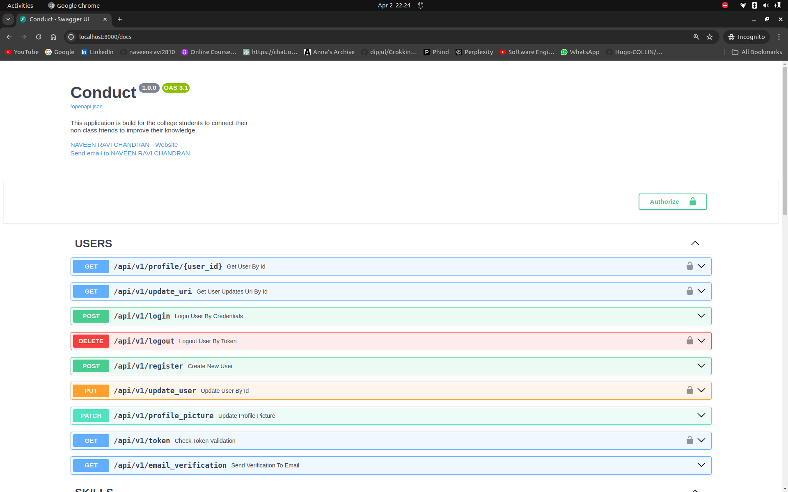
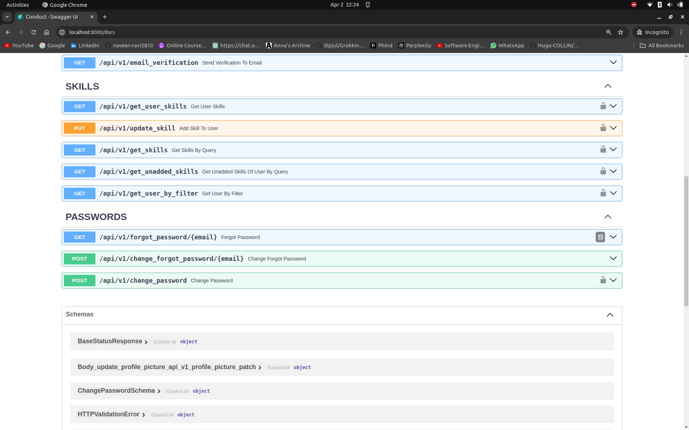
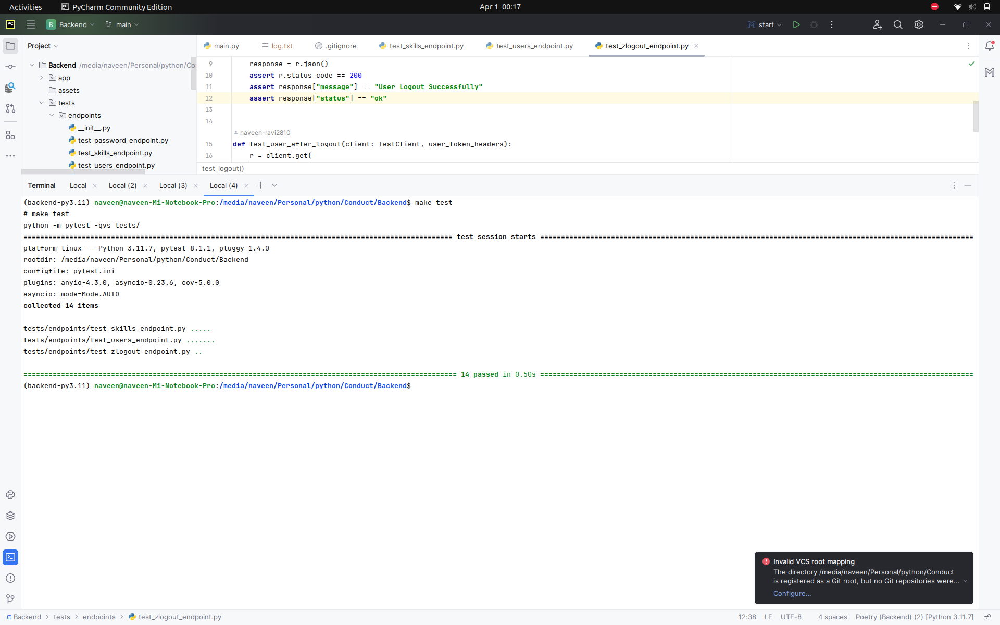

# The Conduct Application

<b><h1>Info</h1></b>
application that engages the students by searching their skills

## STEPS:

clone the repo:

    git clone https://github.com/naveen-ravi2810/Conduct_Backend.git

Add .env just copy it from .env.example  
Need to configure some details from .env file

    cp .env.example .env

Build the image and Run Container

    docker compose up

You can see it in localhost:8000

and read the docs at

<a href='http://localhost:8000/docs'>http://localhost:8000/docs</a>

## Tech stack

   - FastAPI
   - SQLModel (sqlalchemy and pydantic)
   - alembic
   - PostgreSQL
   - Redis
   - Celery
   - FastAPI_Pagination
   - Pytest
   - pydantic_settings
   - smtp
   - bcrypt
   - pyjwt

## Related Images

 

## And has a well test functions with result 

### Errors and Learnings
`errors that i rectified`

1. Writing pytest
    1. Use case of scope
    2. How to yield client
2. Making the Sync API to Async API
3. Writing Dockerfile and docker-compose.yml  
4. Know more about FastAPI_Pagination
   1. Wonder full module to make the pagination good 
5. Writing Makefile for better CI/CD <i>will implement soon</i> 

## End 

1. Written an article and hosted in onrender.com <a href='https://naveenraviblogs.onrender.com/' target='_blank'>Link</a>. 

## What can be contributed

1. Can add test for remaing endpoints
2. add /profile_image adding endpoint
3. Can create rate limiter for the application endpoints
4. Micro services for new services also can be done
5. Can make CI/CD pipelines if possible
6. Write proper Docker compose and docker file file passing without the .env for building image