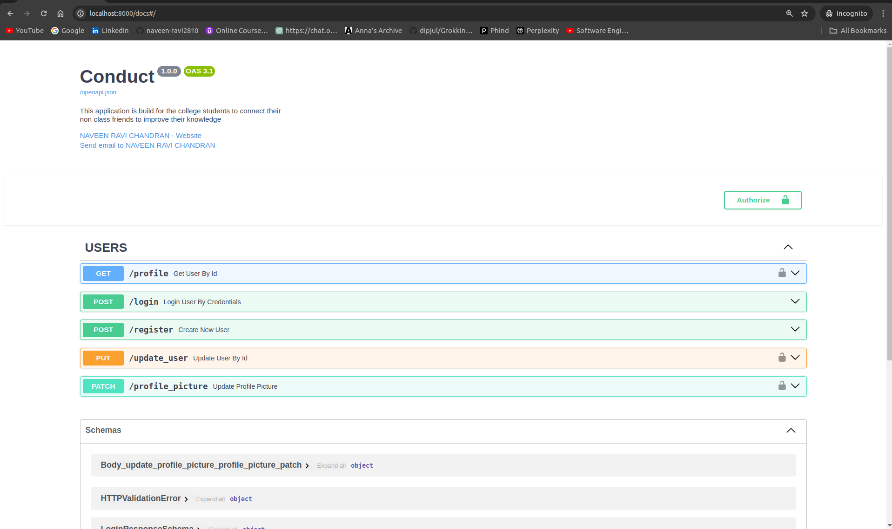

# The Conduct Application

## STEPS:

clone the repo:

    git clone https://github.com/naveen-ravi2810/Conduct_Backend.git

Build the image

    docker build  -t conduct .

Run the Image

    docker run -p8000:8000 <image-id>

You can see it in localhost:8000

and read the docs at

<a href='http://localhost:8000/docs'>http://localhost:8000/docs</a>

User Complete

 